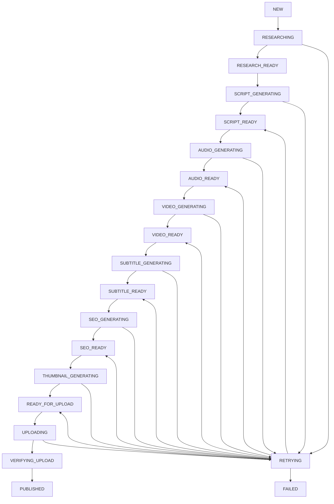

# Persistent Pipeline State Machine

## Purpose

`PipelineTask` is the durable source of truth for content workflow progress. Agents and scheduler jobs must use pipeline state instead of inferring progress from child database rows or file existence.

## Execution Flow

## Data Model

`PipelineTask` fields:

- `task_uuid`: stable external identifier.
- `topic_id`: source topic for the content package.
- `video_id`: final local video once available.
- `current_stage`: exactly one active stage.
- `status`: schedulable lifecycle status.
- `retry_count`: durable retry counter.
- `worker_id`: current worker owner while running.
- `started_at`, `updated_at`, `completed_at`: transition timestamps.
- `last_error`, `last_traceback`: latest failure context.
- `metadata_json`: produced artifact IDs and operational metadata.

Indexes cover stage/status selection, topic lookup, video lookup, and stale-task recovery.

## Transition Rules

All transitions go through `PipelineStateMachine.transition()`.

- Invalid transitions raise `PipelineTransitionError`.
- Every transition is committed in a database transaction.
- Running stages assign `worker_id`.
- Ready stages clear `worker_id`.
- Terminal stages set `completed_at`.
- Failures use `mark_retry_or_failed()` so retry count, error, traceback, and `next_retry_at` are persisted together.

## Scheduler Contract

The scheduler no longer selects work by missing child rows. It selects tasks by stage:

- `SCRIPT_READY` -> audio generation
- `AUDIO_READY` -> video generation
- `VIDEO_READY` -> subtitle generation
- `SUBTITLE_READY` -> SEO generation
- `SEO_READY` -> thumbnail generation
- `READY_FOR_UPLOAD` -> YouTube publishing

Legacy rows are adopted into `PipelineTask` records during scheduler preparation. After adoption, scheduler selection is state-based.

## Crash Recovery

At app startup and before scheduled jobs:

1. Find `RUNNING` tasks older than `PIPELINE_STALE_TIMEOUT_SECONDS`.
2. Mark them `INTERRUPTED`.
3. Move them to the previous safe ready stage.
4. Leave produced artifacts untouched.
5. Let the scheduler resume from that safe boundary.

## Retry Behavior

On failure:

1. Increment `retry_count`.
2. Store `failed_stage`, `retry_ready_stage`, and `next_retry_at`.
3. Move to `RETRYING` if retry count is within `PIPELINE_MAX_RETRIES`.
4. Move to `FAILED` after retries are exhausted.

Due retries are activated back to their previous safe ready stage and selected by normal scheduler queries.

## Backward Compatibility

Existing API endpoints and response schemas are unchanged. Manual endpoints still accept `script_id`, `audio_id`, and `video_id`; those calls adopt existing resources into a `PipelineTask` when needed.

## Remaining Hardening Work

The current implementation is additive and compatible with SQLite. For higher concurrency deployments, add database-level row locking or a compare-and-swap transition update, and enforce single scheduler ownership per deployment.
