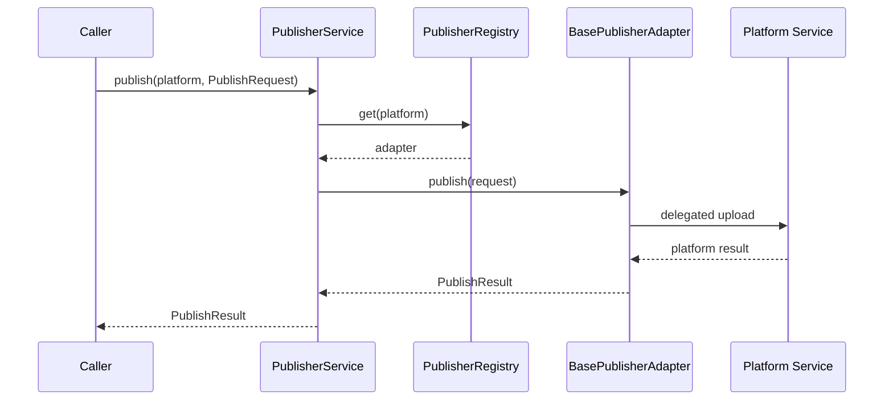
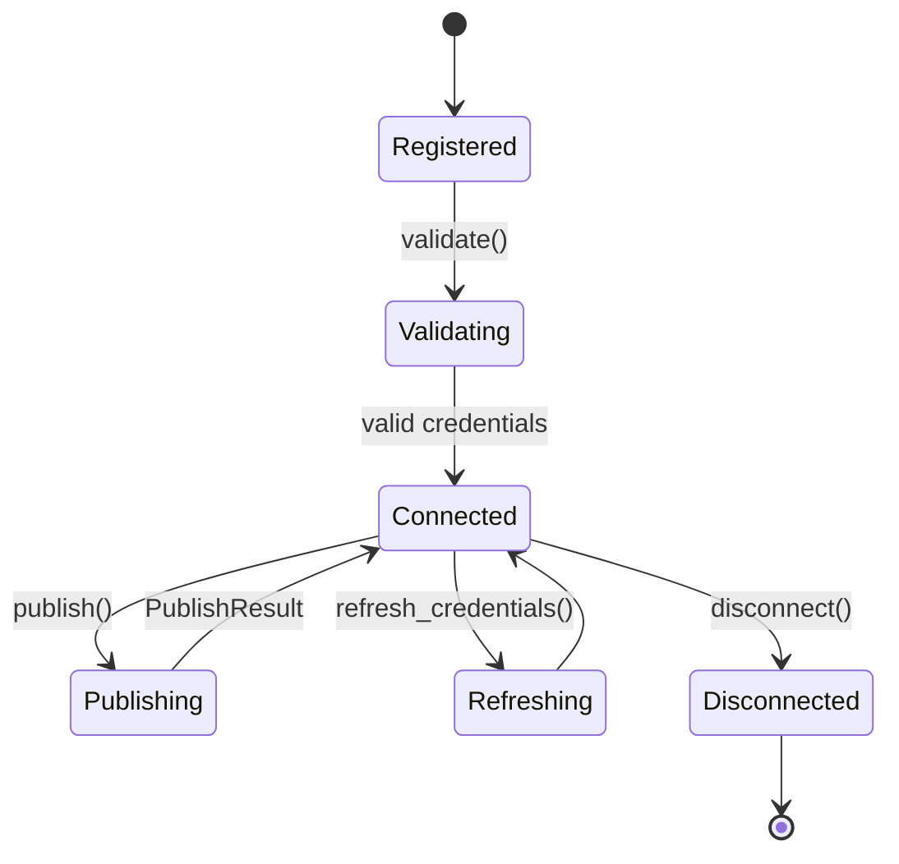

# Publisher Framework

## Architecture

The publisher framework provides a platform-neutral boundary for future publishing integrations. It does not contain platform-specific logic.

Core package:

- `services.publisher.base_adapter.BasePublisherAdapter`: async adapter interface.
- `services.publisher.models`: typed dataclasses shared by adapters.
- `services.publisher.registry.PublisherRegistry`: platform name to adapter lookup.
- `services.publisher.publisher.PublisherService`: platform-neutral facade.
- `services.publisher.exceptions`: framework-level exception hierarchy.

Implemented bridge:

- `platforms.youtube.adapter.YouTubePublisherAdapter`

The YouTube adapter delegates to the existing `YouTubeService` and `YouTubeOAuthService`. Existing API routes, scheduler behavior, manager agent publishing, database schema, and frontend remain unchanged.

## Publish Sequence

## Adapter Lifecycle

## Registration

During FastAPI startup, `PublisherService` is created and a `YouTubePublisherAdapter` is registered under `app.state.publisher_service`.

No current route uses this facade yet. This preserves backward compatibility while making the framework available for future migration.

## Future Extension Guide

To add a platform later:

1. Create `platforms/<platform>/adapter.py`.
2. Subclass `BasePublisherAdapter`.
3. Implement all async methods using that platform's SDK/API.
4. Map platform-specific responses to `PublishResult`.
5. Register the adapter at startup.
6. Add framework tests for registration and delegation.
7. Only then migrate route/scheduler usage when product requirements are ready.

Rules:

- Keep `services.publisher` platform-neutral.
- Use dataclasses from `services.publisher.models`; avoid untyped dictionaries at the framework boundary.
- Do not expose OAuth tokens or platform secrets through `PublishResult`.
- Keep adapter-specific exceptions wrapped in publisher framework exceptions where practical.
